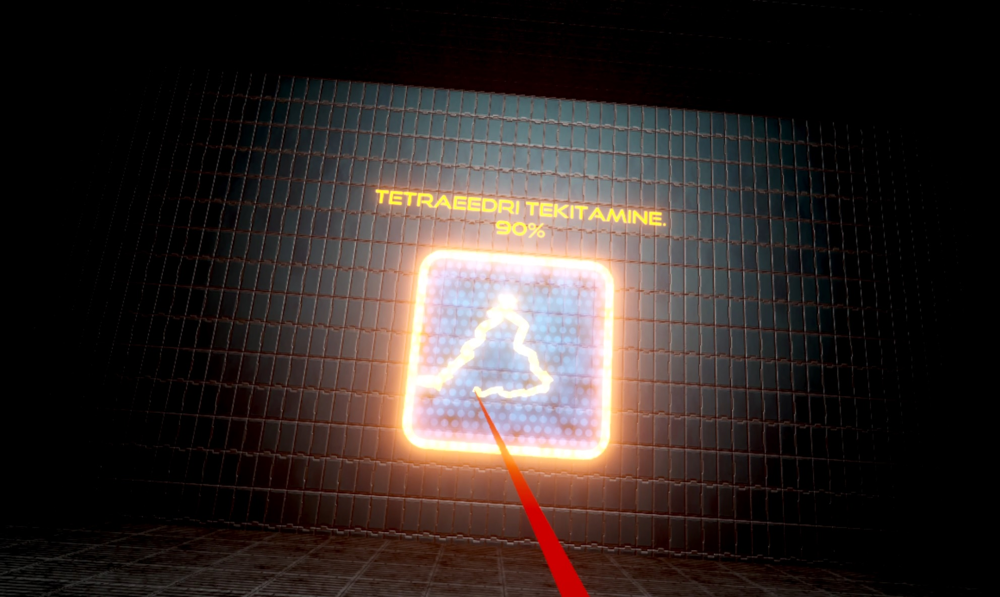

<h1>Joonistuspõhise kasutajaliidesega virtuaalreaalsus prototüüp bakalaureusetöö jaoks.</h1>

Bakalaureusetöö käigus loodud prototüüp, mille eesmärk oli testida joonistuspõhist VR-rakenduse kasutajaliidest.

Projekt tuleks avada versiooniga 2021.2.11f1

Testitud ainult Meta Quest 2 prillidega.

Sisaldab ka Windows Build'i, mida saab käivitada ilma Unity't paigaldamata. Sellekt tuleb avada kasutas "DoodleDetectionVR_Build" fail nimega "Playground.exe". Eelnevalt on vaja ühendada VR-prillid Oculus link abil Windows arvutiga. Vajab üsna võimekat arvutit. Kui prototüüp on avatud, tuleb testimisülesannete käivitamiseks vajutada klaviatuuril klahvi "tühik".

<h2>Prototüübi video</h2>
